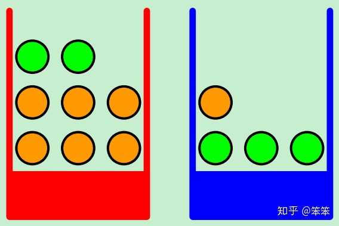
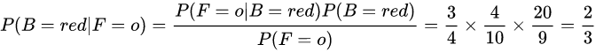
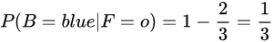

问题：
尽管BMA方法已经得到了长足的发展，但是它存在一些严重的问题。其一是如何确定各个模型的先验概率， 因为不同的先验概率一般对BMA方法的结果影响较大；其二是使用BMA方法时可能针对待估计参数混合一些矛盾的先验，导致直观上难以解释(Hjort & Claeskens 2003)；其三是BMA一般要求真实的模型在所考虑的一类模型之中，然而实际中真实的模型一般会更加复杂(Hansen.2008)以上为引用中科院张新雨老师的论文，目前来看fma发展研究的更多一些，比较贝叶斯需要计算先验概率，如果变量和样本量很大的情况下，计算复杂度太大。张老师是国内做模型平均比较厉害的以为了，有兴趣可以看看他的论文，国外的就是这个Hansen了。
（
先验概率：
指根据以往经验和分析，在实验或采样前就可以得到的概率。
后验概率：
指某件事已经发生，想要计算这件事发生的原因是由某个因素引起的概率。
可以看出，先验概率就是事先可估计的概率分布，而后验概率类似贝叶斯公式“由果溯因”的思想。下面我们通过PRML（Pattern Recognition and Machine Learning）这本书中的例子来理解一下上面的定义。
假设我们现在有两个盒子，分别为红色和蓝色。在红色盒子中放着2个苹果和6个橙子，在蓝色盒子中放着1个橙子和3个苹果，如下图所示：

图中绿色表示苹果，橙色代表橙子。假设我们每次实验的时候会随机从某个盒子里挑出一个水果，随机变量B（box）表示挑出的是哪个盒子，并且P(B=blue) = 0.6（蓝色盒子被选中的概率），P(B=red) = 0.4（红色盒子被选中的概率）。随机变量F（fruit）表示挑中的是哪种水果，F的取值为"a (apple)"和"o (orange)"。

现在假设我们已经得知某次实验中挑出的水果是orange，那么这个orange是从红色盒子里挑出的概率是多大呢？依据贝叶斯公式有：

同时，由概率的加法规则我们可以得到：

在上面的计算过程中，我们将 [公式] 或者说 [公式] 称为先验概率（prior probability），因为我们在得到F是“a”或者“o”之前，就可以得到 [公式] 。同理，将 [公式] 和 [公式] 称为后验概率，因为我们在完整的一次实验之后也就是得到了F的具体取值之后才能得到这个概率。
）

正文：
BMA的解释：
BMA中有个很重要的东西叫做，“集合预报成员”。比如用BMA处理来自于N个模型的模拟结果，即集合预报成员数目为N。
BMA就是围绕着如何利用这N个集合预报成员，这个问题展开的。
以往相似的集合预报技术：
平均：N个成员相同权重，求和
加权平均：N个成员不同权重，求和
BPNN: N个成员不同“信号强度”，经s函数转换后得到新的N个成员，再以不同权重加权，求和。
而BMA则不同，严格意义上来说，BMA理论中没有权重，信号强度的概念，它以成员为最优成员的概率（先验）替代权重等概念，以全概率公式描述变量（后验）概率分布。
贝叶斯公式的特点就是能够通过先验概率和条件概率求后验概率，在许多场合都会用到。不过贝叶斯公式其实刚开始总是不太好理解，需要借助前面通过条件概率和全概率公式的推导来理解。这种例子碰到得多了应该能更加熟练。

BMA的实质：

BMA实际上就是将各模型进行揉合从而降低风险的方法。For the sake of intuition，你希望estimate 某个未知变量X，传统的方法是你选择某一模型进行拟合，发现拟合结果非常好，很开心的就选了它来做后续操作得到estimator。但是，另一个人选择了另一个模型进行拟合，发现这个模型拟合度也非常好，然而在这个模型下X estimate的结果却与之前那个模型相差很大。那这个时候应该选择哪个模型呢？只选择其中某一个模型的做法显然不妥，因为你没有考虑到uncertainty。但BMA就把uncertainty考虑进去了。具体BMA的操作原理去看看论文就能懂了，其实不难懂，难的是实际操作中到底该怎么计算各个模型对应的posterior probability。
