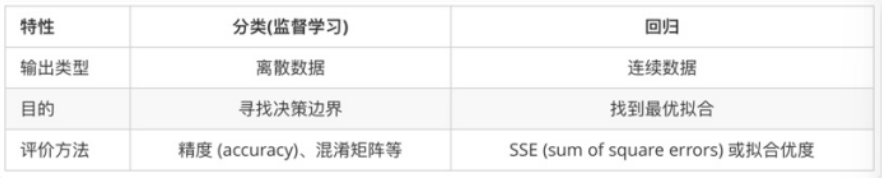

前言：
机器学习的主要任务是聚焦两个问题：分类和回归

区别：
回归会给出一个具体的结果，例如房价的数据，根据位置,周边，配套等等这些维度，给出一个房价的预测。

分类就比如是垃圾邮件的识别，就是做出二分类或者所分类的选择。

浅分：
两者的预测目标变量的类型不同，回归问题是连续变量，分类问题是离散变量。
（
类别变量：
类别变量包含有限的类别数或可区分组数。类别数据可能不是逻辑顺序。例如，类别变量包括性别、材料类型和付款方式。
离散变量：
离散变量是在任意两个值之间具有可计数的值的数值变量。离散变量始终为数值变量。例如，客户投诉数量或者瑕疵或缺陷数。
连续变量：
连续变量是在任意两个值之间具有无限个值的数值变量。连续变量可以是数值变量，也可以是日期/时间变量。例如，零件的长度，或者收到付款的日期和时间。
如果您有离散变量而且想要将其包括在回归或方差分析模型中，可以决定是将其视为连续预测变量（协变量），还是类别变量（因子）。如果离散变量具有许多水平，那么最好将其视为连续变量。将预测变量视为连续变量意味着简单线性或多项式函数足以描述响应和预测变量之间的关系。当您将预测变量视为类别变量时，离散响应值将与变量的每个水平拟合，而不必考虑预测变量水平的顺序。使用此信息，除了可以进行分析以外，还可以确定哪个变量最适合您的情况。
）
中分：
回归问题是定量问题，分类问题是定性问题。
（
定性分析 (Qualitative Research)：
定性分析也称质化研究，是社会科学领域的一种基本研究范式，也是科学研究的重要步骤和方法之一。
定量分析 (Quantitative Research)：
定量分析是与定性分析相对的概念，要考察和研究事物的量，就需用数学工具对事物进行数量的分析，这就叫定量的研究，也称量化研究，是社会科学领域的一种基本研究范式，也是科学研究的重要步骤和方法之一。定量分析是指确定事物某方面量的规定性的科学研究，就是将问题与现象用数量来表示，进而去分析、考验、解释，从而获得意义的研究方法和过程。如果没有数字，那肯定不是定量分析。
）
高分：
回归与分类的根本区别在于输出空间是否为一个度量空间

分类和回归的区别在于输出变量的类型
定量输出称为回归，也就是连续变量预测；
定性输出称为分类，也就是离散变量预测。
举个例子：
预测明天的气温是多少度，这是一个回归任务；
预测明天是阴天，晴天，还是雨天，就是一个分类任务。
